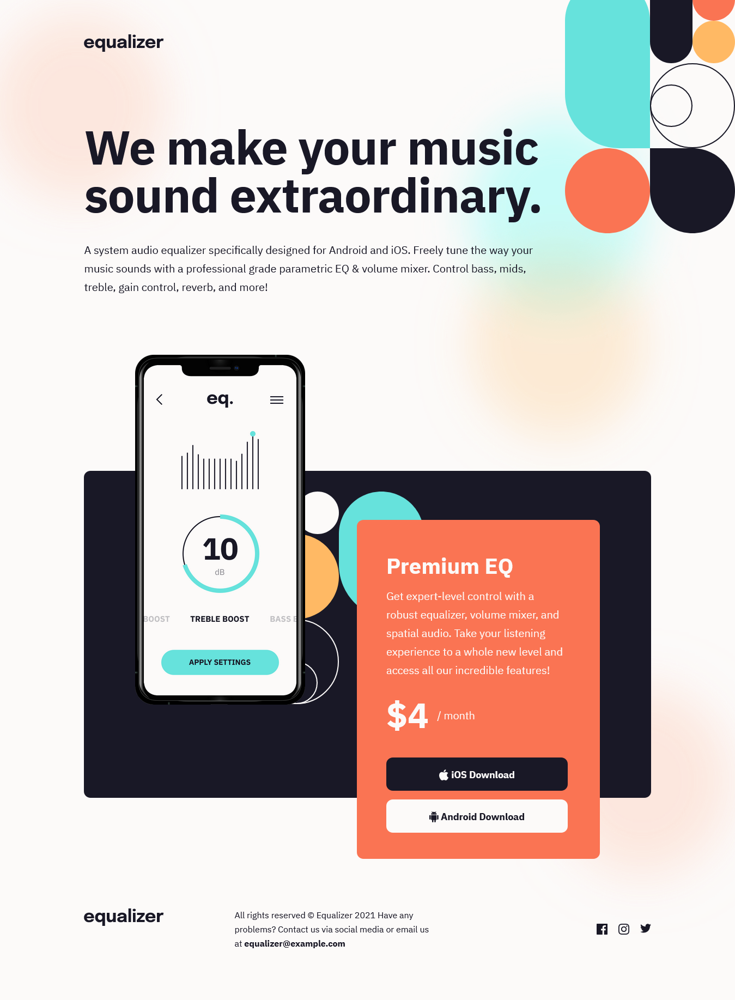

This is a solution to the [Equalizer landing page challenge on Frontend Mentor](https://www.frontendmentor.io/challenges/equalizer-landing-page-7VJ4gp3DE). Frontend Mentor challenges help you improve your coding skills by building realistic projects.

## Table of contents

- [Overview](#overview)
  - [The challenge](#the-challenge)
  - [Screenshot](#screenshot)
  - [Links](#links)
- [My process](#my-process)
  - [Built with](#built-with)
  - [What I learned](#what-i-learned)
  - [Continued development](#continued-development)
  - [Useful resources](#useful-resources)
- [Author](#author)
- [Acknowledgments](#acknowledgments)
- [Summary](#Summary)

**Note: Delete this note and update the table of contents based on what sections you keep.**

## Overview

### The challenge

Users should be able to:

- View the optimal layout depending on their device's screen size
- See hover states for interactive elements

### Screenshot

### Links

- Solution URL: [Add solution URL here](https://www.frontendmentor.io/solutions/equalizer-landing-page-solution-mobile-first-Cg4dAEBH5L)
- Live Site URL: [Add live site URL here](https://equalizer-landing-page-2wx.pages.dev/)

## My process

### Built with

- Semantic HTML5 markup
- CSS custom properties
- Flexbox
- Mobile-first workflow

### What I learned

I think my biggest learning during this challenge was CSS positioning. I had to use 'position: relative' in some divs in order to make z-index work, so some elements would appear in front of the others, and viceversa.

### Continued development

I could not position the background images correctly as per design, even though I used the same margin values. I still have to find out how to make it work, by trying different approaches.

### Useful resources

- [A Complete Guide to Flexbox](https://css-tricks.com/snippets/css/a-guide-to-flexbox/) - This helped me to find the way to space some elements horizontally and vertically in the right way.
- [CSS Layout Positioning](https://developer.mozilla.org/en-US/docs/Learn/CSS/CSS_layout/Positioning) - This guide from Mozilla was useful to understand some aspects of relative positioning.

## Author

- Website - [Alvaro Salazar](https://alvaro-salazar.pages.dev/)
- Frontend Mentor - [@alvarolsr](https://www.frontendmentor.io/profile/alvarolsr)
- Twitter - [@alvarolsr](https://www.twitter.com/alvarolsr)

## Acknowledgments

I did google a lot to solve this challenge. I found very interesting information in sites like stack overflow, in which I could see how other developers would approach very specific issues during a project.

## Summary

Newbie Challenge from Frontend Mentor

Finally completed this challenge, although it is not perfect!

Things I could not make work/display correctly:

- Background sizes and position: I used negative values as per design files, but they do not display the same way.

Things I did:

- Used normalize.css to reset CSS, added prefixes from Autoprefixer, and used preprocessor "prepros".
- Used mobile-first approach
- Set media queries break points at 480 pixels and 768 pixels
- Used flexbox for footer so elements are spaced evenly
- In the mid section, where the device, background pattern and orange box appear, I used percent margins so they appear to move nicely as the window resizes.

Learned a lot while doing my first challenge, and I would appreciate any feedback and recommendations.
